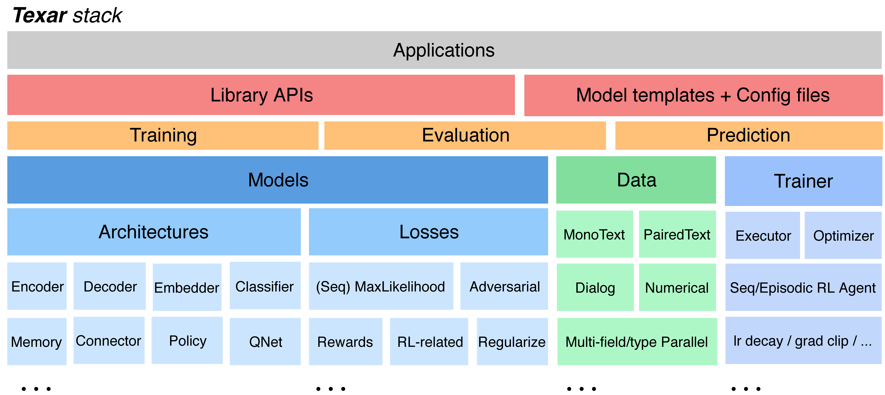

<div align="center">
   <br><br>
</div>
 
-----------------

[](https://pypi.python.org/pypi/texar-pytorch)
[](https://github.com/asyml/texar-pytorch/actions/workflows/main.yml)
[](https://codecov.io/gh/asyml/texar-pytorch)
[](https://texar-pytorch.readthedocs.io/en/latest/?badge=latest)
[](https://github.com/asyml/texar-pytorch/blob/master/LICENSE)
 

**Texar-PyTorch** is a toolkit aiming to support a broad set of machine learning, especially natural language processing and text generation tasks. Texar provides a library of easy-to-use ML modules and functionalities for composing whatever models and algorithms. The tool is designed for both researchers and practitioners for fast prototyping and experimentation. Texar-PyTorch was originally developed and is 
actively contributed by [Petuum](https://petuum.com/) and [CMU](https://www.cmu.edu/) in collaboration with other institutes.
A mirror of this repository is maintained by [Petuum Open Source](https://github.com/petuum).

Texar-PyTorch integrates many of the best features of TensorFlow into PyTorch, delivering highly usable and customizable modules superior to PyTorch native ones. 

### Key Features
* **Two Versions, (Mostly) Same Interfaces**. Texar-PyTorch (this repo) and **[Texar-TF](https://github.com/asyml/texar)** have mostly the same interfaces. Both further combine the best design of TF and PyTorch:
  - Interfaces and variable sharing in *PyTorch convention*
  - Excellent factorization and rich functionalities in *TF convention*.
* **Versatile** to support broad needs:
   - data processing, model architectures, loss functions, training and inference algorithms, evaluation, ...
   - encoder(s) to decoder(s), sequential- and self-attentions, memory, hierarchical models, classifiers, ... 
   - maximum likelihood learning, reinforcement learning, adversarial learning, probabilistic modeling, ... 
* **Fully Customizable** at multiple abstraction level -- both novice-friendly and expert-friendly. 
  - Free to plug in whatever external modules, since Texar is fully compatible with the native PyTorch APIs. 
* **Modularized** for maximal re-use and clean APIs, based on principled decomposition of *Learning-Inference-Model Architecture*. 
* **Rich Pre-trained Models, Rich Usage with Uniform Interfaces**. BERT, GPT2, XLNet, etc, for encoding, classification, generation, and composing complex models with other Texar components!
* Clean, detailed [documentation](https://texar-pytorch.readthedocs.io) and rich [examples](./examples).

<div align="center">
   <br><br>
</div> 

<div align="center">
   <br><br>
</div> 


### Library API Example
A code example that builds and trains a **Conditional GPT2** model (e.g., for machine translation and text summarization):

```python
import texar.torch as tx
from texar.torch.run import *

# (1) Modeling
class ConditionalGPT2Model(nn.Module):
  """An encoder-decoder model with GPT-2 as the decoder."""
  def __init__(self, vocab_size):
    super().__init__()
    # Use hyperparameter dict for model configuration
    self.embedder = tx.modules.WordEmbedder(vocab_size, hparams=emb_hparams)
    self.encoder = tx.modules.TransformerEncoder(hparams=enc_hparams)
    self.decoder = tx.modules.GPT2Decoder("gpt2-small")  # With pre-trained weights

  def _get_decoder_output(self, batch, train=True):
    """Perform model inference, i.e., decoding."""
    enc_states = self.encoder(inputs=self.embedder(batch['source_text_ids']),
                              sequence_length=batch['source_length'])
    if train:  # Teacher-forcing decoding at training time
      return self.decoder(
          inputs=batch['target_text_ids'], sequence_length=batch['target_length'] - 1,
          memory=enc_states, memory_sequence_length=batch['source_length'])
    else:      # Beam search decoding at prediction time
      start_tokens = torch.full_like(batch['source_text_ids'][:, 0], BOS)
      return self.decoder(
          beam_width=5, start_tokens=start_tokens,
          memory=enc_states, memory_sequence_length=batch['source_length'])

  def forward(self, batch):
    """Compute training loss."""
    outputs = self._get_decoder_output(batch)
    loss = tx.losses.sequence_sparse_softmax_cross_entropy(  # Sequence loss
        labels=batch['target_text_ids'][:, 1:], logits=outputs.logits,
        sequence_length=batch['target_length'] - 1)  # Automatic masking
    return {"loss": loss}

  def predict(self, batch):
    """Compute model predictions."""
    sequence, _ = self._get_decoder_output(batch, train=False)
    return {"gen_text_ids": sequence}

  
# (2) Data
# Create dataset splits using built-in data loaders
datasets = {split: tx.data.PairedTextData(hparams=data_hparams[split])
            for split in ["train", "valid", "test"]}

model = ConditionalGPT2Model(datasets["train"].target_vocab.size)

# (3) Training
# Manage the train-eval loop with the Executor API
executor = Executor(
  model=model, datasets=datasets,
  optimizer={"type": torch.optim.Adam, "kwargs": {"lr": 5e-4}},
  stop_training_on=cond.epoch(20),
  log_every=cond.iteration(100),
  validate_every=cond.epoch(1),
  train_metric=("loss", metric.RunningAverage(10, pred_name="loss")),
  valid_metric=metric.BLEU(pred_name="gen_text_ids", label_name="target_text_ids"),
  save_every=cond.validation(better=True),
  checkpoint_dir="outputs/saved_models/")
executor.train()
executor.test(datasets["test"])
```
Many more examples are available [here](./examples).


### Installation
Texar-PyTorch requires:

* `python == 3.6` or `3.7`
* `torch >= 1.0.0`. Please follow the [official instructions](https://pytorch.org/get-started/locally/#start-locally) to install the appropriate version.

After `torch` is installed, install Texar from PyPI: 
```bash
pip install texar-pytorch
```

To use cutting-edge features or develop locally, install from source: 
```
git clone https://github.com/asyml/texar-pytorch.git
cd texar-pytorch
pip install .
```

To use *tensorboard* support with `Executor`, please install `tensorboardX` with the following command

```commandline
pip install tensorboardX
```


### Getting Started
* [Examples](./examples)
* [Documentation](https://texar-pytorch.readthedocs.io)


### Reference
If you use Texar, please cite the [tech report](https://arxiv.org/abs/1809.00794) with the following BibTex entry:

```
Texar: A Modularized, Versatile, and Extensible Toolkit for Text Generation
Zhiting Hu, Haoran Shi, Bowen Tan, Wentao Wang, Zichao Yang, Tiancheng Zhao, Junxian He, Lianhui Qin, Di Wang, Xuezhe Ma, Zhengzhong Liu, Xiaodan Liang, Wanrong Zhu, Devendra Sachan and Eric Xing
ACL 2019

@inproceedings{hu2019texar,
  title={Texar: A Modularized, Versatile, and Extensible Toolkit for Text Generation},
  author={Hu, Zhiting and Shi, Haoran and Tan, Bowen and Wang, Wentao and Yang, Zichao and Zhao, Tiancheng and He, Junxian and Qin, Lianhui and Wang, Di and others},
  booktitle={ACL 2019, System Demonstrations},
  year={2019}
}
```

### License
[Apache License 2.0](./LICENSE)

### Companies and Universities Supporting Texar
<p float="left">
   
   &nbsp;&nbsp;&nbsp;&nbsp;&nbsp;&nbsp;&nbsp;&nbsp;&nbsp;&nbsp;&nbsp;&nbsp;&nbsp;&nbsp;&nbsp;&nbsp;&nbsp;&nbsp;
   
</p>
