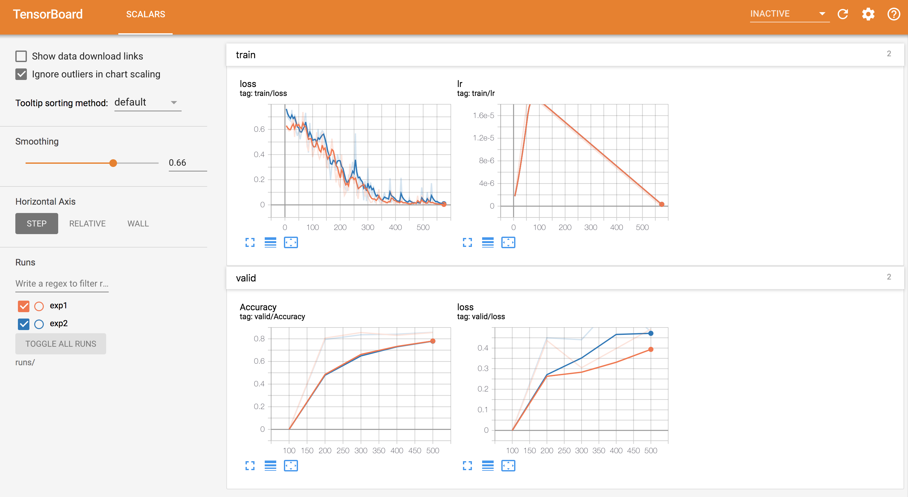

# BERT: Pre-trained models and downstream applications

This is a Texar implementation of Google's BERT model, which allows to load pre-trained model parameters downloaded
from the [official release](https://github.com/google-research/bert) and build/fine-tune arbitrary downstream
applications (This example showcases BERT for sentence classification).

Texar provides ready-to-use modules including
[`BERTEncoder`](https://texar-pytorch.readthedocs.io/en/latest/code/modules.html#bertencoder),
and [`BERTClassifier`](https://texar-pytorch.readthedocs.io/en/latest/code/modules.html#bertclassifier).
This example shows the use of `BERTClassifier` for sentence classification tasks.

To summarize, this example showcases:

* Use of pre-trained Google BERT models in Texar
* Building and fine-tuning on downstream tasks
* Use of Texar `RecordData` module for data loading and processing
* Use of Texar `Executor` module for simplified training loops and TensorBoard visualization
* Use of [Hyperopt]((https://github.com/hyperopt/hyperopt)) library to tune hyperparameters with 
`Executor` module

Future work:

* Train or fine-tune the model with distributed GPU

## Prerequisite

#### Install dependencies

Apart from requiring Texar-PyTorch, you should also satisfy dependencies in `requirements.txt` by running:

```bash
pip install -r requirements.txt
```

## Quick Start

### Download Dataset

We explain the use of the example code based on the Microsoft Research Paraphrase Corpus (MRPC) corpus for sentence
classification.

Download the data with the following command:
```bash
python data/download_glue_data.py --tasks=MRPC
```
By default, it will download the MRPC dataset into the `data` directory. FYI, the MRPC dataset is part of the
[GLUE](https://gluebenchmark.com/tasks) dataset collection.

### Prepare data

We first preprocess the downloaded raw data into [pickled](https://docs.python.org/3/library/pickle.html) files. The
preprocessing step tokenizes raw text with BPE encoding, truncates sequences, adds special tokens, etc. Run the
following command to this end: 

```bash
python prepare_data.py --task=MRPC \
    --max-seq-length=128 \
    --pretrained-model-name=bert-base-uncased \
    --output-dir=data/MRPC
```

- `--task`: Specifies the dataset name to preprocess. BERT provides default support for
  `{'CoLA', 'MNLI', 'MRPC', 'XNLI', 'SST'}` data.
- `--max-seq-length`: The maxium length of sequence. This includes BERT special tokens that will be automatically added.
  Longer sequences will be trimmed. 
- `--pretrained-model-name`: The name of a pre-trained model to load selected in the list of: `bert-base-uncased`,
  `bert-large-uncased`, `bert-base-cased`, `bert-large-cased`, `bert-base-multilingual-uncased`,
  `bert-base-multilingual-cased`, and `bert-base-chinese`.
- `--output-dir`: The output path where the resulting pickled files will be put in. Be default, it is set to `data/{task}`
  where `{task}` is the (upper-cased) dataset name specified in `--task` above. So in the above command, the pickled
  files are written to `data/MRPC`.

**Outcome of the Preprocessing**:

- The preprocessing will output 3 pickled data files `{train.pkl, eval.pkl, test.pkl}` in the specified output
  directory.

- The command also prints logs as follows:

  ```
    INFO:root:Loading data
    >> Downloading uncased_L-12_H-768_A-12.zip 100.0%%
    Successfully downloaded uncased_L-12_H-768_A-12.zip 407727028 bytes.
    INFO:root:Extract bert_pretrained_models/uncased_L-12_H-768_A-12.zip
    INFO:root:num_classes: 2; num_train_data: 3668
    INFO:root:config_data.py has been updated
    INFO:root:Data preparation finished
  ```
  **Note that** the data info `num_classes` and `num_train_data`, as well as `max_seq_length` specified in the command,
  are required for BERT training in the following. They should be specified in the data configuration file passed to
  BERT training (see below). 
  
- For convenience, the above command automatically writes `num_classes`, `num_train_data` and `max_seq_length` to
  `config_data.py`.

### Train and Evaluate

For **single-GPU** training (and evaluation), run the following command. The training updates the classification layer
and fine-tunes the pre-trained BERT parameters.

```bash
python bert_classifier_main.py --do-train --do-eval \
    --config-downstream=config_classifier \
    --config-data=config_data \
    --output-dir=output
```
Here:

- `--config-downstream`: Configuration of the downstream part. In this example,
  [`config_classifier`](./config_classifier.py) configures the classification layer and the optimization method.
- `--config-data`: The data configuration. See the default [`config_data.py`](./config_data.py) for example. Make sure
  to specify `num_classes`, `num_train_data`, `max_seq_length`, and `pickle_data_dir` as used or output in the above
  [data preparation](#prepare-data) step.
- `--output-dir`: The output path where checkpoints are saved.
- `--pretrained-model-name`: The name of a pre-trained model to load selected in the list of: `bert-base-uncased`,
  `bert-large-uncased`, `bert-base-cased`, `bert-large-cased`, `bert-base-multilingual-uncased`,
  `bert-base-multilingual-cased`, and `bert-base-chinese`. 

After convergence, the evaluation performance is around the following. Due to certain randomness (e.g., random
initialization of the classification layer), the evaluation accuracy is reasonable as long as it's `>0.84`.
An example output is as follows:
```
Using cached pre-trained BERT checkpoint from texar_download/BERT/bert-base-uncased.
INFO:root:step: 50; loss: 0.448667
INFO:root:step: 100; loss: 0.400019
INFO:root:step: 150; loss: 0.340314
INFO:root:step: 200; loss: 0.151271
INFO:root:step: 250; loss: 0.093740
INFO:root:step: 300; loss: 0.161118
INFO:root:eval accu: 0.8554; loss: 0.4524; nsamples: 408
```

### Restore and Test

```bash
python bert_classifier_main.py --do-test --checkpoint=output/model.ckpt
```

The output is by default saved in `output/test_results.tsv`, where each line contains the predicted label for each
example.


## Use other datasets/tasks

`bert_classifier_main.py` also support other datasets/tasks. To do this, specify a different value to the `--task`
flag when running [data preparation](#prepare-data).

For example, use the following commands to download the SST (Stanford Sentiment Treebank) dataset and run for sentence
classification. Make sure to specify the correct data path and other info in the data configuration file.

```bash
python data/download_glue_data.py --tasks=SST
python prepare_data.py --task=SST
python bert_classifier_main.py --do-train --do-eval --config-data=<config_data>
```

## Using Executor Module
To use this feature, please install `tensorboardX` by issuing the following command

```commandline
pip install tensorboardX
```

`bert_classifier_using_executor_main.py` shows how to use `Executor` module for a typical
`train-eval-test` loop. We initialize an `Executor` object with all the required properties like
datasets, logging, metrics etc. Executor is also integrated with tensorboardX (tbX) to help
visualize the training process. To use tBX support, provide `tbx_logging_dir` indicating the
directory to save the logs and `tbx_log_every` for frequency of logging to the Executor object. All
the `train_metrics` and `valid_metrics` will be logged into tensorboard. To run
`bert_classifier_using_executor_main.py`, run the following command

```commandline
python bert_classifier_using_executor_main.py --do-train --do-test
``` 

If the logs are in `runs/` folder, the tensorboard server can be started by the following command

```commandline
tensorboard --logdir runs/
```



## Hyperparameter tuning with Executor

To run this example, please install `hyperopt` by issuing the following command

```commandline
pip install hyperopt
```

`bert_with_hypertuning_main.py` shows an example of how to tune hyperparameters with Executor using `hyperopt`. 
To run this example, run the following command

```commandline
python bert_with_hypertuning_main.py
```

In this simple example, the hyperparameters to be tuned are provided as a `dict` in
`bert_hypertuning_config_classifier.py` which are fed into `objective_func()` . We use `TPE`
(Tree-structured Parzen Estimator) algorithm for tuning the hyperparams (provided in `hyperopt`
library). The example runs for 3 trials to find the best hyperparam settings. The final model is
saved in `output_dir` provided by the user. More  information about the libary can be 
found at [Hyperopt](https://github.com/hyperopt/hyperopt).
